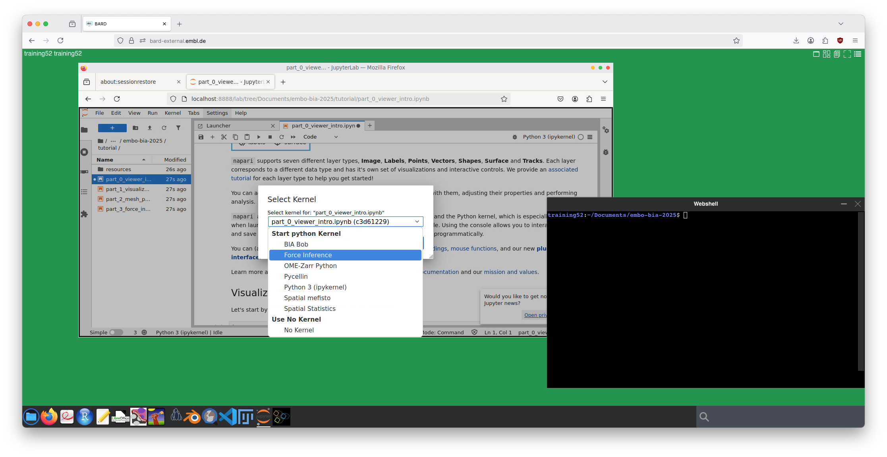

# 2025 Advanced methods in bioimage analysis course Force Inference tutorial 

## Running locally
If you are running this tutorial on your local machine, you can set up the Python environment using [`uv`](https://docs.astral.sh/uv/) or [`mamba`](https://github.com/conda-forge/miniforge).

### uv
To run with [`uv`](https://docs.astral.sh/uv/), do the following in your terminal:

```bash
# clone the repo
git clone https://github.com/kevinyamauchi/embo-bia-2025.git

# navigate into the repo
cd embo-bia-2025

# launch jupyter with uv
uv run --with jupyter jupyter lab
```
This will install the environment and launch the Jupyter Lab server.

### mamba
To setup your environment with [`mamba`](https://github.com/conda-forge/miniforge)/conda, do the following (replace mamba with conda if you are using conda)

```bash
# clone the repo
git clone https://github.com/kevinyamauchi/embo-bia-2025.git

# navigate into the repo
cd embo-bia-2025

# create the environment
mamba create -f conda_env.yaml

# activate the environment
mamba activate force-inference

# launch jupyter lab
jupyter lab
```

## Running on Bard
1. Log into Bard using your course credentials. Provision a machine of your choice. I have tested on the "lowest" and it worked.
2. Clone this tutorial repository into your Documents folder:
    - Open the "Web shell" from the search

      
      
    - `cd ~/Documents`
    - `git clone https://github.com/kevinyamauchi/embo-bia-2025.git`
4. Launch the Jupyter instance.
5. Navigate to your cloned folder and open the `tutorials` directory. This directory contains the notebooks. Be sure to use the "Force Inference" kernel.

  

6. Work through the notebooks in pairs. There are solutions in the `solutions` subdirectory
7. Post questions to the course forum.

## References
**Mesh processing**
- Foambryo [repo](https://github.com/VirtualEmbryo/foambryo) and [paper](https://www.nature.com/articles/s41592-023-02084-7): This is the surface reconstruction and force inference method we use in this tutorial.
- [potpourri3d](https://github.com/nmwsharp/potpourri3d): mesh and point cloud processing library
- [vedo](https://github.com/marcomusy/vedo): Python-based mesh processing library with a focus on scientific data.
- [pyvista](https://docs.pyvista.org/): Mesh processing and visualization library built on top of [VTK](https://vtk.org/).
- [surface_morphometrics](https://github.com/GrotjahnLab/surface_morphometrics): pipeline for measuring properties of surfaces. Originally designed for cryo-ET data, but likely useful elsewhere.
- [napari-process-points-and-surfaces](https://github.com/haesleinhuepf/napari-process-points-and-surfaces): napari plugin for processing point clouds and meshes. This might not be compatible with recent versions of napari. In any case, the source code should give inspiration for how to process meshes.

**Force inference**
- Foambryo [repo](https://github.com/VirtualEmbryo/foambryo) and [paper](https://www.nature.com/articles/s41592-023-02084-7): This is the surface reconstruction and force inference method we use in this tutorial.
- [Image-based force inference by biomechanical simulation](https://journals.plos.org/ploscompbiol/article?id=10.1371/journal.pcbi.1012629): Force inference method that utilizes a biomechanical simulation framework capable of simulating more forces than foam-like models.
- [Fully three-dimensional force inference in intestinal organoids reveals ratchet-like bud stabilization](https://www.biorxiv.org/content/10.1101/2025.04.02.646749v1.abstract): force inference with pressure, surface tension, and line tension.
