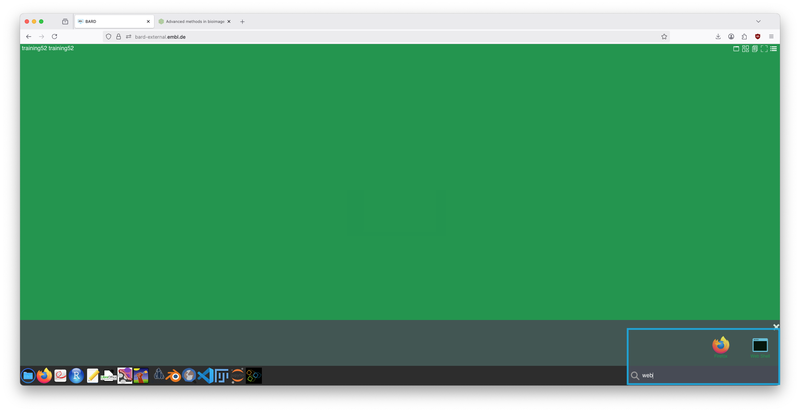

# 2025 Advanced methods in bioimage analysis course Force Inference tutorial 

## Instructions
1. Log into Bard using your course credentials. Provision a machine of your choice. I have tested on the "lowest" and it worked.
2. Clone this tutorial repository into your Documents folder:
    - Open the "Web shell" from the search

      
      
    - `cd ~/Documents`
    - `git clone https://github.com/kevinyamauchi/embo-bia-2025.git`
4. Launch the Jupyter instance.
5. Navigate to your cloned folder and open the `tutorials` directory. This directory contains the notebooks. Be sure to use the "Force Inference" kernel.

  

6. Work through the notebooks in pairs. There are solutions in the `solutions` subdirectory
7. Post questions to the course forum.